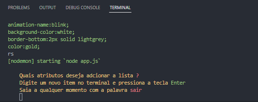
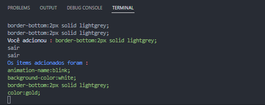

## Facilitando o dia a dia.
## Projeto Individual Mod5.
 "Print do código da aplicação"

## Tencologias utilzadas.
- `Node`
- `Chalk`
- `Nodemon`

## Instalando as dependências necessárias.
` npm install `

## Dependências utilizadas no projeto.

- `Chalk`
- `readline`
## .
Para instalar somente a dependência do chalk já que o nodemon foi importado do `NPM` como dependência de desenvolvimento,e o readline é uma dependência do Node presente nas versões mais recentes.
` npm install `
## Nodemon
A aplicação então irá se repetir sempre que for terminada , esperando sempre por uma entrada após enviar o resultado da última vez que a aplicação foi instanciada.
## Funcionamento do código.
-`npm start`
O foco do projeto é uma aplicação/ferramenta que rodará no node tendo como interface o terminal, e a aplicação deverá ser capaz de `auxiliar desenvolvedores` no dia a dia com `CSS`.
A aplicação recebe via terminal `propriedas de CSS` às armazena e sendo encerrada pelo utilizador encerra o laço em que roda a aplicação roda ao enviar `sair` no terminal, devolvendo as `propriedades`recebidas ordenadas de A-Z.
-` node app.js`
Irá iniciar a aplicação,e terminará o processo quando a aplicação for finalizada com a string `sair` no terminal.
## Com o pacote nodemon a aplicação poderá ser inicializada com `npm start`

## Aplicação iniciada, esperando a primeira entrada.

## Resultado ao finalizar o funcionamento da aplicação.

